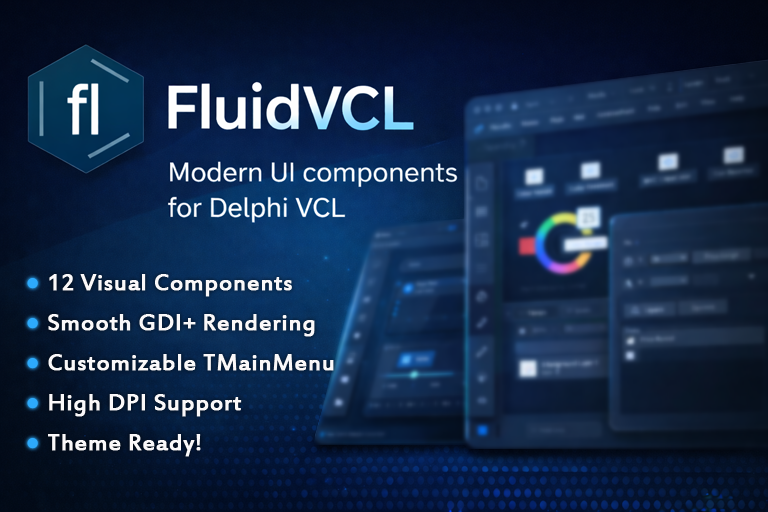

# FluidVCL

FluidVCL is a modern, high-performance set of VCL components for Delphi 10.x and above. Built with Windows GDI+, it brings a contemporary, fluid aesthetic to classic desktop applications—featuring anti-aliased rounded corners, smooth state transitions, and deeply customizable layouts.

Designed for developers who love native Windows apps but want visuals that feel current, FluidVCL focuses on performance, clarity, and control rather than heavy external frameworks.

---

## Key Features

* **GDI+ Rendering**
  All components use GDI+ for crisp edges, anti-aliasing, and smooth visuals.

* **Highly Customizable**
  Fine-grained control over border radius, thickness, colors, padding, and visual states.

* **Modern Interactions**
  Built-in hover, pressed, focused, and disabled states for responsive UI behavior.

* **Lightweight**
  No heavy dependencies—relies solely on the native Windows GDI+ stack.

---

## Support the Project

FluidVCL is developed and maintained for free. If these components save you time or help you ship better-looking applications, please consider supporting the project. Your donations help fund new controls, improvements, and long-term maintenance.

You can support the project here:
[https://buymeacoffee.com/ignuicould](https://buymeacoffee.com/ignuicould)

---

## Included Components

### Input & Text

**TFluidEdit**
Advanced edit control with embedded left/right buttons, glyph icons, and placeholder text.

**TRoundedEdit**
Customizable single-line editor with rounded borders and solid, dashed, or dotted outlines.

**TRoundedMemo**
Multi-line editor with modern styling and optional AutoHeight behavior.

**TRoundedComboBox**
Sleek dropdown selector with custom-rendered items and rounded popup lists.

---

### Buttons & Selection

**TRoundedButton**
Versatile button supporting custom shapes, word wrapping, and independent color states.

**TRoundedSpeedButton**
Lightweight button with optional borders, PNG/JPEG glyphs, and ModalResult support.

**TFluidRange**
Advanced slider control supporting single or dual thumbs, snap-to-ticks, and floating “bubble” value indicators.

**TFluidColorBox**
HSV color picker featuring a saturation/value map and hue slider.

---

### Layout & Navigation

**TRoundedPanel**
Modern container with adjustable corner radius and hover-aware border rendering.

**TGroupablePanel**
Smart grouping container that supports radio-style selection with visual feedback.

**TMenuPanel**
Bridges classic TMainMenu with a modern UI by rendering menus directly onto a panel with custom popups.

**TRoundedGroupBox**
Styled GroupBox replacement with adjustable corner radii and GDI+ text rendering.

---

## Installation

The easiest way to install FluidVCL is using the provided package:

1. Open **FluidVCL.dpk** in the Delphi IDE.
2. In Project Manager, right-click the project and select **Build**.
3. Right-click again and choose **Install**.

Add the source folder to your Library Path:

* Add the FluidVCL source directory for your target platform (Win32/Win64).

---

## Final Note

Built by someone who still loves building native Windows apps, clean rendering, and squeezing every ounce of polish out of the VCL. I hope FluidVCL makes your next project more enjoyable… happy coding!
